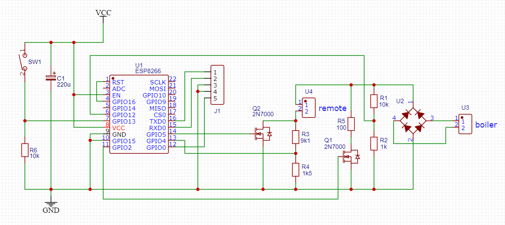

# OpenMasterGas

Данный проект ставит своей целью автоматизацию управления газовым котлом Master Gas Seoul (производитель Daesung Celtic Enersys Co.).  
Все сведения о протоколе, представленные в данном репозитории, получены опытным путем. Официальная документация не использовалась. Описание может содержать ошибки, неточности или неполные сведения.

## Протокол

Пульт управления подключается по двум проводам, полярность значения не имеет.  
Интерфейс подобен OpenTherm и представляет собой UART с уровнем 21В, скорость обмена 4800 бод, без проверки четности, 1 стоп-бит.  
Ведущим устройством является котел, ведомым - пульт управления.  
Котел инициирует обмен, передавая свое состояние в пакете 7 байт, затем отключает с линии питание 21В, оставляя подтяжку к верхнему уровню.  
В это время пульт управления должен передать в ответ 7 байт.  
Котел передает запросы двух типов: статус (0xF9), и дополнительные данные (0xFA).  
На запрос со статусом пульт должен ответить, иначе котел прекратит работу. На запрос второго типа можно не отвечать.  

### Запрос котла (статус):

|размер, бит|описание|
|---|---|
|8|0xF9|
|8|0x00|
|1|?|
|1|статус горелки (1 - вкл., 0 - выкл.)|
|6|?|
|8|температура теплоносителя|
|8|температура ГВС|
|8|?|
|8|контрольная сумма|

### Запрос котла (дополнительные данные):

|размер, бит|описание|
|---|---|
|8|0xFA|
|8|смещение, значение от 0x00 до 0x14, кратно 4|
|32|?|
|8|контрольная сумма|

### Ответ пульта:

|размер, бит|описание|
|---|---|
|8|0xF9|
|8|0x80|
|7|режим работы (отопление и ГВС/только ГВС/Защита от замерзания)|
|1|питание (1 - вкл., 0 - выкл.)|
|8|целевая температура теплоносителя|
|8|целевая температура ГВС|
|8|температура воздуха по датчику в пульте|
|8|контрольная сумма|

Контрольная сумма считается следующим образом: суммируются 6 байт пакета, затем сумма инвертируется, и прибавляется 1.  

## Схема WiFi адаптера

## Cкетч

В работе
